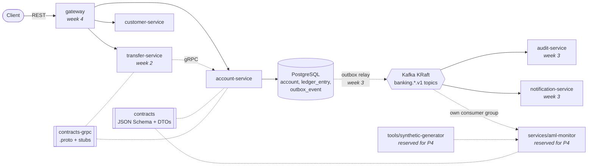

# corebank-lite

[](https://github.com/EgeOzdemirr/corebank-lite/actions/workflows/ci.yml)

A bank must never lose or invent money. Every transfer has to be booked twice (debit and credit) and balance to
zero, two concurrent requests must not overwrite each other's balance, every business change has to leave an auditable
event behind, and a later compliance component has to be able to read those events without anyone rewriting the
producers. **corebank-lite** is a small core banking system built around those guarantees: Spring Boot
microservices with a double-entry ledger, optimistic locking, a transactional outbox and versioned event contracts
designed from the first week for a transaction monitoring component that will live in the same repository.

> **No personal data is processed.** All names, TCKNs and IBANs are synthetic. TCKNs and IBANs satisfy their check
> digit algorithms but are generated at random, and IBANs use the unassigned bank code `99999`.

## Architecture



| Module | State | Responsibility |
| --- | --- | --- |
| `contracts` | done | Versioned event schemas (JSON Schema) and generated DTOs, shared with `aml-monitor` |
| `contracts-grpc` | done | Versioned `.proto` of the internal ledger API and generated gRPC stubs |
| `services/account-service` | done | Account opening, double-entry ledger, balances, transactional outbox, internal gRPC posting API |
| `services/transfer-service` | in progress | Transfers, state machine, limits, maker-checker, idempotency, saga (domain model done) |
| `services/customer-service` | skeleton | Customers, KYC status, synthetic TCKN validation |
| `services/gateway` | skeleton | Routing, JWT validation, rate limiting |
| `services/audit-service` | skeleton | Append-only, hash-chained audit trail |
| `services/notification-service` | skeleton | Simulated e-mail and SMS |
| `services/aml-monitor` | reserved | Transaction monitoring and IT general controls (P4); added later, consumes `contracts` |
| `tools/synthetic-generator` | reserved | Synthetic event generator so `aml-monitor` can run without P1 (P4) |

## Run it

Prerequisites: Docker, JDK 21.

```bash
cp .env.example .env              # then change the password
docker compose up -d              # PostgreSQL 18, Kafka 4 (KRaft) and the versioned topics
./mvnw -q install -DskipTests     # builds contracts and the services
./mvnw -pl services/account-service spring-boot:run
```

| Service | HTTP | gRPC |
| --- | --- | --- |
| account-service | `8080` (Swagger UI: <http://localhost:8080/swagger-ui.html>) | `9090` (internal, ADR-0004) |
| transfer-service | `8081` (arrives later in week 2) | - |

Ports can be changed in `.env` (`ACCOUNT_SERVICE_PORT`, `ACCOUNT_SERVICE_GRPC_PORT`). gRPC reflection is off by
default; run with `SPRING_PROFILES_ACTIVE=local` to let tools such as `grpcurl -plaintext localhost:9090 list`
discover the internal API.

- Open an account with an opening deposit:

```bash
curl -s -X POST localhost:8080/api/v1/accounts \
  -H 'Content-Type: application/json' -H 'X-Correlation-Id: demo-1' -H 'X-Actor-User-Id: demo-user' \
  -d '{"customerId":"7d0f5a3e-4c1b-4a8e-9d2c-1f3e5b7a9c01","holderName":"Zeynep Arslan",
       "holderTckn":"10000000146","currency":"TRY","openingDeposit":"2500.00"}'
```

Then `GET /api/v1/accounts/{id}/balance` and `GET /api/v1/accounts/{id}/ledger-entries`.

Running the services themselves from `docker compose up` as well is planned for week 6, once each service has a
non-root container image.

## Demo

_A demo GIF will be added in week 6._

## Technical decisions

- [ADR-0001: Event contracts are designed for the transaction monitoring component](docs/adr/0001-event-contracts-designed-for-transaction-monitoring.md)
- [ADR-0002: Ledger immutability is enforced in the database as well as in the application](docs/adr/0002-ledger-immutability-enforced-in-database.md)
- [ADR-0003: Funding balances are derived from the ledger; customer accounts are row-locked in id order](docs/adr/0003-hot-account-contention.md)
- [ADR-0004: transfer-service calls account-service over gRPC; postings are idempotent on a caller-chosen id](docs/adr/0004-internal-posting-api-grpc.md)

Further decisions in code, each enforced by a test:

- **Money** is a value object: `BigDecimal`, scale 2, `HALF_EVEN`, always with a currency. `double`/`float` fail the
  build (Checkstyle).
- **Double-entry ledger:** every posting has at least two lines that sum to zero. The domain rejects unbalanced
  postings, and a deferred PostgreSQL constraint trigger rejects them at commit even if application code is bypassed.
  Ledger rows are append-only: UPDATE, DELETE and TRUNCATE are rejected by triggers (ADR-0002).
- **Balances** depend on the account type (ADR-0003). Customer accounts keep a materialised balance that cannot go
  below zero; postings lock them in account id order (`SELECT ... FOR NO KEY UPDATE`), so concurrent postings neither
  lose updates nor deadlock, and `@Version` remains as a second guard. The bank's funding accounts (the contra side of
  opening deposits) may go negative and do not store a balance at all: it is derived from the ledger, so concurrent
  openings never contend for their row.
- **Internal posting API (gRPC, ADR-0004):** transfer-service looks up customer accounts and posts transfers through
  `LedgerService`. `PostTransfer` is idempotent on the caller's posting id, also for concurrent retries, so a timeout
  can be retried without moving money twice. Errors carry a stable code in `google.rpc.ErrorInfo`.
- **Transactional outbox:** `AccountOpened` is written in the same transaction as the account. The relay to Kafka
  comes in week 3.
- **Transfer state machine:** CREATED -> PENDING_APPROVAL (above the approval threshold) -> APPROVED -> POSTED, with
  FAILED and REVERSED as error paths. One table in `TransferStatus` defines every allowed step; any other step throws
  `InvalidStateTransitionException`, and a test covers all 36 status pairs.
- **Maker-checker:** the user who created a transfer above the threshold cannot approve it. Below the threshold a
  transfer is approved automatically and has no checker (`checkerUserId` is null in events).
- **Limits per currency:** approval threshold, single transaction limit and daily limit come from configuration and
  must satisfy threshold <= single <= daily. The daily total counts per Europe/Istanbul business day.
- **Layering** (`api -> application -> domain`, infrastructure behind ports) is enforced by ArchUnit.

## Tests and quality

`./mvnw verify` runs everything below. Any violation fails the build, locally and in CI.

| Gate | Tool |
| --- | --- |
| Style, naming, no magic numbers, no floating point money | Checkstyle |
| Code smells, copy-paste detection | PMD, CPD |
| Bug patterns | SpotBugs |
| Unit and slice tests | JUnit 5, AssertJ, Mockito, Spring `@WebMvcTest` |
| Integration tests against real PostgreSQL | Testcontainers |
| Layer rules | ArchUnit |
| Event contract conformance | JSON Schema validation of the outbox payload |
| Line coverage of at least 80% | JaCoCo |
| Secrets | gitleaks (pre-commit hook and CI) |

Current numbers (week 2, in progress):

| Module | Tests | Line coverage | Branch coverage |
| --- | --- | --- | --- |
| contracts | 32 | 100% | n/a |
| account-service | 190 unit + 34 integration | 99.6% | 93.8% |
| transfer-service (domain) | 125 unit | 99.7% | 90.0% |

Performance measurements (k6, p95 latency) will be added in week 6.

## Known limitations

- account-service is implemented; transfer-service has its domain model, its API arrives next. The other services are
  skeletons.
- Outbox rows are not yet relayed to Kafka (week 3).
- No authentication yet: the acting user comes from the `X-Actor-User-Id` header until Keycloak and the gateway
  arrive (week 4).
- Postings on one customer account are serialised by its row lock (a little under 500 per second per account in the
  ADR-0003 measurement). A funding account's balance is a sum over its ledger lines; periodic snapshots are the
  planned answer if that read becomes slow.
- The internal gRPC port has no TLS and no authentication yet; it must only be reachable inside the service network.
- Only PostgreSQL; the Oracle reporting profile comes later (the Oracle image needs extra care on Apple Silicon).

---

## Türkçe özet

corebank-lite; hesap, havale ve çift taraflı defter servislerinden oluşan küçük bir çekirdek bankacılık sistemidir. Para
`BigDecimal` (2 ondalık, HALF_EVEN) ile tutulur, her kayıt borç ve alacak olarak toplamı sıfır olacak şekilde deftere
yazılır, müşteri bakiyeleri hesap id sırasıyla satır kilidiyle korunur, funding bakiyeleri defterden türetilir
(ADR-0003) ve her iş değişikliği aynı veritabanı işleminde outbox tablosuna olay olarak düşer. Olay sözleşmeleri
(`contracts`) sürümlüdür ve ileride aynı repoya `services/aml-monitor/` olarak eklenecek işlem izleme bileşeni
düşünülerek tasarlanmıştır (ADR-0001). **Kişisel veri işlenmez;** tüm veriler sentetiktir.
